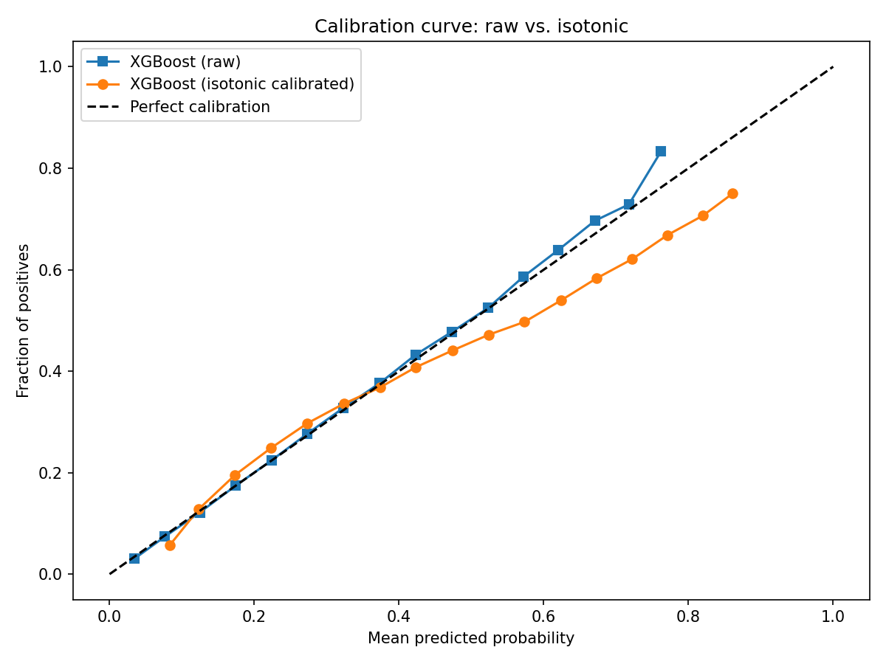

# creditdefpipeline

End-to-end credit risk decision engine with ML pipeline and profit optimization.

## Data Dictionary

## The Model Setup

We define our binary target variable as "Repaid" (0) or "Default" (1). Approximately 20% of all loans are defaulted, therefore we need to be cautious about using accuracy as a success proxy.

We then performed some basic EDA and could quickly notice some correlation between default rates and loan grade & debt-to-income ratio. Higher grade loans are defaulted less, and higher DTI loans are defaulted more. No surprises there.

We then cleaned column formatting, removed nulls, and engineered some new features like Loan-to-income (LTI), FICO midpoint, and some behavioral flags like derogatory public record.

Our finalized dataset has 46 columns with ~1.3M documented loans.

## Model Selection + Results

We now have a binary classification problem with reasonable dimensionality, lots of examples, and class 80-20 imbalance. In our `config.yaml` we set test size to 20% and validation to 10% with 5 cross-validation folds. We then use a standard scaler to scale the validation and test set using the spread of `X_train`. 

We kept the modelling relatively conservative & used three binary classification staples: standard log regression, XGBoost, and a neural network classifier. In a real business environment, we would repeat with more models and a hyperparameter search for more effective profit maximization.

## The Model Results

We evaluated our models using AUC:
XGBoost: 0.722
Neural Network: 0.715
Logistic Regression: 0.711

We then saved our pytorch and scikit models.

## Model Re-Evaluation

In notebook 4, we chose XGBoost by AUC and aimed to optimize profits by performing more rigorous evaluation. In `profit_config.py` we defined the average loan amount, interest rate, loan length, and resulting loss from a default, then relayed results to `config.yaml`. We calculated average interest revenue and loss amounts using those numbers, then used our model trained in `03_baseline_models.ipynb` to get soft default probabilities on our test set. We then calculated expected profits per loan and created the profit curve, which plots the portfolio profits vs. decision threshold to find the optimized threshold. 

We then use our results to devise a decision engine that calculates a softmax probability of defaulting, and decides whether to approve/deny the loan based on our predicted profits.

We got profitable results, but there is evidence of under-approval form our Risk-segment analysis:

--- Risk segment analysis ---
                  loan_count  avg_p_default  avg_expected_profit  actual_default_rate
risk_segment                                                                         
Very Low (<10%)         5891          0.077          5697.641113                0.019
Low (10-20%)           20982          0.155          4325.985840                0.042
Medium (20-30%)        33773          0.253          2600.538086                0.076
High (30-50%)          93955          0.403           -17.466999                0.145
Very High (>50%)      114461          0.634         -4067.008057                0.319

It seems like our model is systematically over-approving loans.

### Calibration/Scale Fix

Our XGB model initially chose 0.34 as the optimal threshold with a maximum portfolio profit of $137M (~$100 profit per loan.) versus a $38M profit at the baseline approval threshold of 0.50. However, our initial XGBoost probabilities were systematically overconfident 
(predicted 0.63 default rate where actual was 0.31). 

We ran diagnostic checks for model efficiency- our original analysis yielded a contextually valid SHAP analysis but poor calibration analysis. Our results yielded:

--- Calibration Check ---
Brier score: 0.2144 (lower is better, 0.25 = random)
Predicted 0.08 → Actual 0.02 (overpredicting by 0.06)
Predicted 0.16 → Actual 0.04 (overpredicting by 0.11)
Predicted 0.25 → Actual 0.08 (overpredicting by 0.18)
Predicted 0.35 → Actual 0.12 (overpredicting by 0.23)
Predicted 0.45 → Actual 0.17 (overpredicting by 0.28)
Predicted 0.55 → Actual 0.24 (overpredicting by 0.31)
Predicted 0.65 → Actual 0.32 (overpredicting by 0.33)
Predicted 0.74 → Actual 0.43 (overpredicting by 0.31)
Predicted 0.83 → Actual 0.57 (overpredicting by 0.26)
Predicted 0.91 → Actual 0.75 (overpredicting by 0.16)

Our calibration check is a robust check on the test net that indicates our model's tendency to overpredict probabilities. Our model was being too conservative with default rates (only 24% defaulted at an estimated 55% rate), which would have significantly reduced profit margins. Our residual analysis corroborated this:

--- Residual Analysis ---

Mean residual by DTI bucket (negative = overpredicting default):
dti_bucket
0-10    -0.2288
10-20   -0.2472
20-30   -0.2739
30-40   -0.2908
40+     -0.2944

Mean residual by FICO bucket:
fico_bucket
620-660   -0.2874
660-700   -0.2785
700-740   -0.2269
740+      -0.1629

Mean residual by term:
term
36   -0.2411
60   -0.3033

Overall mean residual: -0.2561

The mean residual error overly penalizes by dti buckets, term length, and fico buckets. (i.e. the model tells us for 60-year term `actual default probability` - `estimated default probability` = -0.30, meaning the actual default rate was 30% lower than we estimated).
The model shows clear indication of over-conservative defaulting estimates- which could lead to significant profit reduction. We will troubleshoot this by analyzing class imbalances (there are less defaulters than non-defaulters, which may be affecting model results).

We fixed this by including class calibration, which adjusts the predictions from cost-weighted model scores into probabilities that reflect the true default rate in the population, restoring alignment between predicted and observed default frequencies across risk buckets.
This yielded the following calibration curves:

We can see that the calibrated data is fitting extremely well until the probabilities get high- it seems that calibration alone does not fix our model and there may still be some underlying issues with our data or XGB model.

I went back to `03_baseline_models.ipynb` to debug and fish through the code for possible breaking points. After looking through, I recognized that the overcompensating discrepancy was brought by `scale_pos_weight=(all y=0)/(all y=1)`. Although `scale_pos_weight` is designed to help compensate for class imbalances, it gives additional weight to loans that actually did default but were classified as safe (FPs). This can be okay when optimizing precision and F1 score, but has reductive impacts when optimizing for profits and when each positive has an associated number attached to a success.

We commented out `scale_pos_weight` and our profit increased tenfold (our model was willing to inherit more calculated risk since it was not penalized as heavy for a misclassification). Our new risk segment analysis yielded:

Risk segment analysis:
                  loan_count  avg_p_default  avg_expected_profit  actual_default_rate
risk_segment                                                                         
Very Low (<10%)        63086          0.063          5936.731934                0.060
Low (10-20%)           91230          0.148          4449.655762                0.146
Medium (20-30%)        62457          0.245          2746.018066                0.247
High (30-50%)          45482          0.375           467.338013                0.380
Very High (>50%)        6807          0.558         -2741.462891                0.567

Our new maximization threshold settled at 0.40

Unfortunately, there is still an issue with our result. The portfolio profit vs. decision threshold is now underestimating the losses per and considers 100% acceptance to still be hugely profitable. 

Our calibration results yielded:

Brier score (raw):        0.1436
Brier score (calibrated): 0.1443
Optimal threshold: 0.40
Max portfolio profit: $1,005,757,308
Approval rate at optimal: 90.9%

Which is good- but only on paper! A 90% approval rate with hardly any profit downswing beyond 0.40 threshold is not realistic and our model is undercalculating the effect of a defaulted loan. The losses per loan calculations were shoddy and not based on real firm losses that inherit

# What Was Learned

- A calibration check is a diagnostic tool, not a tell all about underlying errors. Don't jump straight into isotonic/sigmoid calibration methods without performing EDA/hyperparameter searches unless you have a strong AUC. This is because the AUC tells us the probability of ranking a random positive over a random negative (i.e. how frequently is my model saying this [actual 1] is more likely to be a 0 than this [actual 0]- and vice versa). With a strong AUC (let's say, 0.85) the model is mostly (85% of the time) correctly ranking probabilities, meaning the activation function may just need some calibration to properly boost the raw probabilities and correctly assign a 1 or 0.
- Do not use `scale_pos_weight` ("tipping the scale") unless there is certainty about the distribution of 1s and 0s in the actual target variable. If strong scale adjustment is needed (i.e. there's a very low chance of defaulting, like with fraud) we may want to try anomaly detection as an alternative.

Post-calibration results:
- Brier score: [add updated score]
- Optimal threshold: 0.34
- Portfolio profit: $659M (+4.7x vs. uncalibrated)

The profit improvement reflects the uncalibrated model 
incorrectly rejecting ~57% of profitable loans (86% approval 
post-calibration vs. 29% pre-calibration).